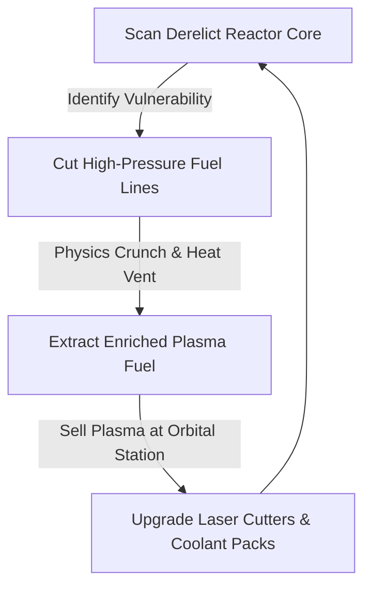

# game-ideation

## Core Philosophy
Game concepts are cheap; captivating gameplay loops are rare and difficult. A game idea is not a 200-page fantasy lore bible or a list of disjointed cool features. A real game concept is an operational hypothesis about player psychology, mechanical friction, and emotional agency. Great game ideation engineers an unforgettable Core Loop, clarifies the central fantasy fulfillment, articulates an undeniable hook, and tests core mechanics immediately using disposable tabletop or greybox prototypes.

---

## 4-Step Game Ideation & Prototyping Framework

### Step 1: The Core Gameplay Loop (The 30-Second Micro Loop)
1. **The Recursive Loop Anatomy**:
   - Every great game is built on a tight, repeatable 30-second loop:
     $$text{Action (Friction)}  o text{Feedback (Sensory Juice)}  o text{Reward (Dopamine)}  o text{Reinvestment / Mastery}$$
   - *Example (Hades)*: Dash-strike enemy (Action) $ o$ Screen shake + blood crunch sound (Feedback) $ o$ Darkness / Boon drop (Reward) $ o$ Upgrade passive abilities (Reinvestment).
2. **The Macro Loop**:
   - How does the 30-second micro-loop feed the 20-minute session loop and the 40-hour metagame progression?

### Step 2: Fantasy Fulfillment & The "Why You Play" Hook
1. **The Core Emotional Fantasy**:
   - What visceral role does the player inhabit? (e.g. "An exhausted spaceship salvage contractor dismantling nuclear reactors under zero gravity").
2. **The "X Meets Y with a Twist" Elevator Hook**:
   - Formulate the unique commercial wedge:
     - *"Subnautica meets Papers, Please: You are a border control officer inspecting alien biology on an underwater research colony."*
   - If the hook cannot be visualized in 1 sentence, the market cannot understand it.

### Step 3: The 3 Pillars of Mechanical Design
1. **Define the 3 Inviolable Pillars**:
   - Pillars are design constraints that resolve all future gameplay arguments:
     - Pillar 1: *Every resource is physical and heavy.*
     - Pillar 2: *Sound is lethal; stealth requires silence.*
     - Pillar 3: *Zero procedural generation; hand-crafted atmospheric environmental storytelling.*

### Step 4: Disposable Paper & Greybox Prototyping
1. **The 24-Hour Paper Prototype**:
   - Before touching Unity or Unreal, simulate the core mechanics using paper cards, dice, index cards, and a stopwatch.
   - If the core loop is not engaging and tense as a physical tabletop game, adding 3D graphics and shaders will not fix it.
2. **The Greybox Prototype**:
   - Build a 3-day digital prototype using raw untextured cubes and basic collision geometry. Test exclusively: *Does moving, jumping, and shooting feel inherently satisfying in a vacuum?*

---

## Deliverable Format: 1-Page Game Concept Document (`GAME-CONCEPT.md`)

```markdown
# Game Concept & Core Loop Document: [Working Title]

## 1. High Concept & Commercial Hook
- **Working Title**: *Reactor Salvage: Zero-G*
- **The Hook (1 Sentence)**: *Hardspace: Shipbreaker* meets survival horror: dismantle derelict fusion reactors under zero-gravity while managing heat, radiation, and structural collapse.
- **Target Audience / Genre**: Sci-Fi Simulation / Atmospheric Physics Survival (PC / Steam)
- **Primary Player Fantasy**: The meticulous, blue-collar technical specialist surviving on dangerous industrial knowledge.

## 2. The Core Gameplay Loops


## 3. The 3 Design Pillars
1. **Pillar 1: Kinetic Industrial Danger**: Machinery behaves with realistic momentum; a loose steel beam crushes the player.
2. **Pillar 2: Technical Problem Solving Over Reflexes**: Success requires reading schematics and pressure gauges, not twitch aim.
3. **Pillar 3: Atmospheric Isolation**: Audio is restricted strictly to player breathing, suit alarms, and metallic creaks.

## 4. Paper Prototype Validation Findings
- **Tabletop Test**: Tested fuel extraction card game with 4 players.
- **Insight**: Managing overheating risk generated immense tension; confirmed heat management as the primary mechanical driver.
```

---

## Worked Example: Refining a Bloated RPG Concept

- **Original Pitch**: A 100-hour fantasy open-world RPG with 20 classes, base-building, naval combat, and political intrigue.
- **Paring Down**: Stripped all fluff; focused on the single most engaging mechanic: "A merchant managing a potion shop in a monster-besieged fortress."
- **Outcome**: Concept became a hyper-focused, successful indie hit with a clear 30-second loop and distinct market identity.

---

## Verification Checklist

- [ ] Core 30-second gameplay loop is diagrammed (Action -> Feedback -> Reward -> Reinvestment).
- [ ] Elevator hook explains the unique commercial premise in one sentence.
- [ ] 3 inviolable design pillars are established to guide future scope decisions.
- [ ] Paper or tabletop simulation confirms mechanics are fun before code is written.
- [ ] Concept defines clear player fantasy and emotional fulfillment.

---

## Anti-Patterns

- **The Worldbuilder's Trap**: Writing 40 pages of fictional history and mythology before deciding how the player interacts with a door.
- **Feature Creep by Default**: Adding crafting, fishing, and base-building to a tactical shooter simply because other games have them.
- **Ignoring the Core Loop**: Building environments and assets for months without having a playable, fun 30-second mechanic prototype.
